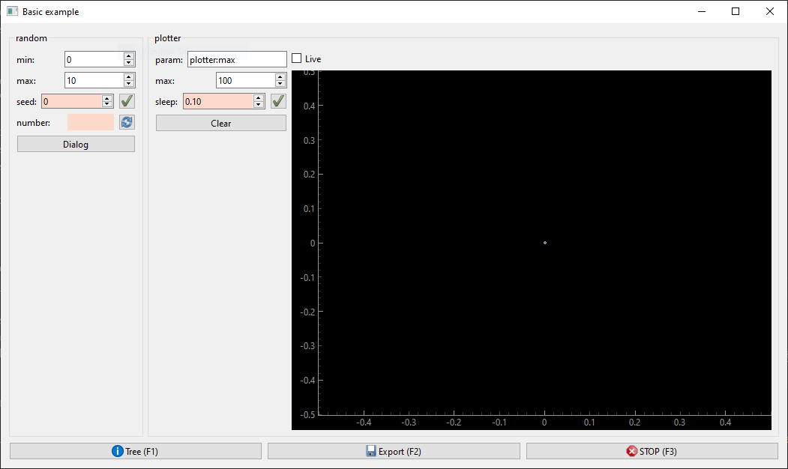
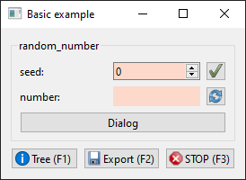
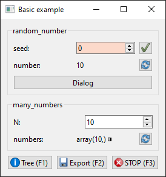

.. puzzlepiece documentation master file, created by
   sphinx-quickstart on Tue Apr 25 11:52:22 2023.
   You can adapt this file completely to your liking, but it should at least
   contain the root `toctree` directive.

Welcome to the puzzlepiece documentation!
=========================================

**Puzzlepiece is a GUI-forward Python framework for automating experimental setups.** It focuses on abstracting communication
with a piece of hardware into **standard inputs, outputs, and actions**. It then automatically **generates GUI components** for them,
minimising the need for boilerplate code. Puzzlepiece allows the user to bring diverse controls into a single, consolidated application,
and automate their interaction or experiment using a unified API, either by making custom Pieces, or through a built-in script language,
or with Interactive Python.

You can install puzzlepiece using pip::

   pip install puzzlepiece

Example application
===================

Constructing a Puzzle (the GUI window containing your automation) is very easy - you create one, and then you add all the Pieces
you'd like in a grid layout::

   import puzzlepiece as pzp
   from puzzlepiece.pieces import random_number, plotter

   # Create a Qt app that will run our GUI, and the Puzzle - its main window
   app = pzp.QApp([])
   puzzle = pzp.Puzzle(app, "Basic example")

   # Add Pieces to the Puzzle
   puzzle.add_piece("random", random_number.Piece, row=0, column=0)
   puzzle.add_piece("plotter", plotter.Piece, 0, 1)

   # Show the Puzzle window and execute the Qt application
   puzzle.show()
   app.exec()

This will give you a GUI window you can interact with directly:

Creating Pieces
===============

Pieces are single GUI modules that a Puzzle is constructed out of. It's very easy to make a Piece, you just
need to think about the methods you want to use to set/get its parameters and perform actions.

Once these methods are defined, you can use puzzlepiece decorators to register them with the Piece,
which will give you a unified API and GUI components automatically::

   import puzzlepiece as pzp
   import random

   class RandomNumber(pzp.Piece):
      def define_params(self):
         # Some params have a 'setter' function, which sets a value, like a laser's power.
         # In that case we make the function (which takes a value) and decorate it with
         # a param-defining decorator
         @pzp.param.spinbox(self, "seed", 0)
         def seed(self, value):
            random.seed(value)
         
         # Some params have a 'getter' function, which returns a value, like a powermeter's reading
         # In that case we make the function (which returns a value) and decorate it with
         # a readout-param-defining decorator
         @pzp.param.readout(self, "number")
         def random_number(self):
            return random.randint(0, 10)
      
      def define_actions(self):
         # Sometimes an action is needed, like homing a moving stage.
         # In that case we make the function (which performs the action) and decorate it with
         # an action-defining decorator - this gives it a button in the GUI
         @pzp.action.define(self, "Dialog")
         def print_something(self):
            print("Hello world!")

You can then add this Piece to any Puzzle and display it easily::

   app = pzp.QApp([])
   puzzle = pzp.Puzzle(app, "Basic example")
   puzzle.add_piece("random_number", RandomNumber, 0, 0)
   puzzle.show()
   app.exec()

Interactions between Pieces
===========================

One Puzzle can contain multiple Pieces, and they can interact with each other through the Puzzle.
For example we can create a Piece that accesses the RandomNumber generator created above::

   class ManyNumbers(pzp.Piece):
      def define_params(self):
         # This param does not require a setter or getter, so it gets
         # None as its argument
         pzp.param.spinbox(self, "N", 10)(None)

         # This param contains a numpy array
         @pzp.param.array(self, 'numbers')
         def numbers(self):
            values = []
            # Check this Piece's own param to see how many numbers the user wants
            N = self.params["N"].get_value()
            for i in range(N):
               # Get param value from the other Piece
               values.append(puzzle["random_number"].params["number"].get_value())
            return values

Once we add both Pieces to a Puzzle they can interact with each other::

   app = pzp.QApp([])
   puzzle = pzp.Puzzle(app, "Basic example")
   puzzle.add_piece("random_number", RandomNumber, 0, 0)
   puzzle.add_piece("many_numbers", ManyNumbers, 1, 0)
   puzzle.show()
   app.exec()

Running in Jupyter Lab/Notebook
===============================

Running puzzlepiece in an IPython environment gives you the powerful ability to interact with your automation
application both through the GUI and through code.

Two steps are necessary to enable this. First, the Qt integration has to be enabled by running this magic in any cell::

   %gui qt

Second, the Qt app is constructed for you by the IPython kernel, so you don't have to make it or run it yourself. Instead say::

   shell = get_ipython()
   puzzle = pzp.Puzzle(shell.kernel.app, "Basic example")
   puzzle.add_piece("random_number", RandomNumber, 0, 0)
   puzzle.show()

Now you can interact with the GUI directly, or by running Python code in other cells, for example::

   values = []
   for i in range(10):
      values.append(puzzle["random_number"].params["number"].get_value())

Note that there is a fix in ``ipykernel`` 6.29.3 to how exceptions are handled when ``%gui qt`` is turned on,
you may want to update ``ipykernel`` if your cells are not running after an exception is raised.

Next steps
==========

The :ref:`Tutorial` is a great place to start - have a look or run it yourself to learn interactively!

Some more detailed examples are located on GitHub: `how to construct an app <https://github.com/jdranczewski/puzzlepiece/tree/main/examples>`_
or `how to code a Piece <https://github.com/jdranczewski/puzzlepiece/blob/main/puzzlepiece/pieces/random_number.py>`_. Examples of more complex
Pieces `are also available <https://github.com/jdranczewski/puzzlepiece/tree/main/puzzlepiece/pieces>`_.
The full source code is available at https://github.com/jdranczewski/puzzlepiece.

This documentation is meant as a good way to familiarise yourself with the library too - have a look at the table of contents below.

.. toctree::
   :maxdepth: 2
   :caption: Contents:

   modules
   tutorial

Indices and tables
==================

* :ref:`genindex`
* :ref:`modindex`
* :ref:`search`
